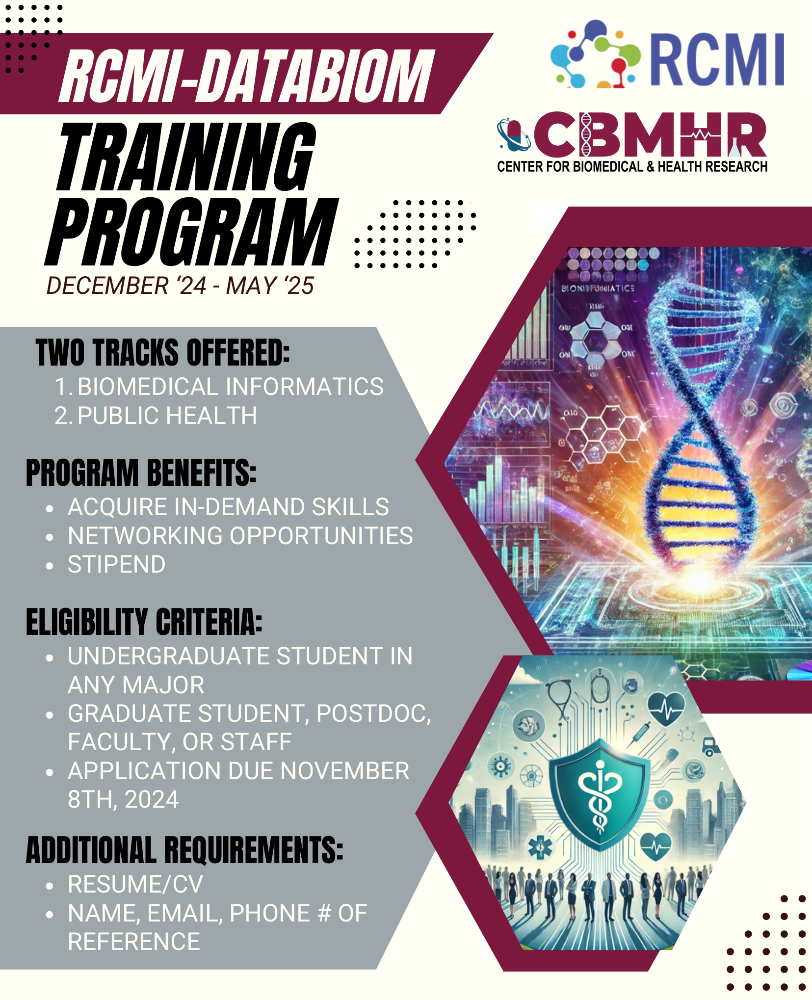

# DATABIOM Bioinformatics Training Resources



Curated, public-ready training materials from the **RCMI-DATABIOM**
bioinformatics training program (December 2024 – May 2025), covering
bioinformatics fundamentals, HPC/Linux, R, public-data acquisition, bulk
RNA-seq, and single-cell RNA-seq analysis. This release is drawn from the
original course materials, cleaned of institution-specific and third-party
material — see `EXCLUSIONS.md` for exactly what was left out and why.

## Audience

Undergraduate students, graduate students, postdocs, faculty, or staff with
no prior bioinformatics experience who want a hands-on introduction to
computational biology on an HPC cluster. No programming background is
assumed.

## Objectives

By working through this material, you should be able to:

1. Navigate a Linux command line and submit jobs on an HPC cluster.
2. Write and run basic R scripts for data analysis.
3. Find and download public sequencing data from GEO/SRA.
4. Run a bulk RNA-seq pipeline from raw reads to differential expression
   and functional enrichment results.
5. Run a single-cell RNA-seq pipeline from raw reads to clustering and
   cell-cell communication analysis.

## Prerequisites

- Access to an HPC cluster (or a local Linux/macOS environment) with
  standard bioinformatics tools installable — see `resources.md` for the
  full tool list.
- No prior programming experience required; basic comfort with a computer
  is sufficient.

## Curriculum sequence

This course was originally delivered as 5 lecture sessions (296 slides
total), each paired with hands-on scripts:

| # | Lecture | Topics | Scripts |
|---|---|---|---|
| 1 | [`01_introduction_to_bioinformatics_and_hpc.pdf`](lectures/01_introduction_to_bioinformatics_and_hpc.pdf) (68 slides) | What is bioinformatics; HPC/SSH/Open OnDemand access; Linux fundamentals; SLURM job submission; intro to GEO/SRA | `protocols/linux_hpc_basics.md`, `protocols/geo_sra_data_acquisition.md` |
| 2 | [`02_introduction_to_r.pdf`](lectures/02_introduction_to_r.pdf) (55 slides) | R and RStudio basics, data types/structures, tidyverse/dplyr, reading and exporting data | `scripts/r_intro/` |
| 3 | [`03_bulk_rnaseq_part1_ngs_qc_alignment.pdf`](lectures/03_bulk_rnaseq_part1_ngs_qc_alignment.pdf) (56 slides) | NGS fundamentals, FastQC/MultiQC quality control, reference genome download, STAR alignment | `scripts/bulk_rnaseq/` |
| 4 | [`04_bulk_rnaseq_part2_deseq2.pdf`](lectures/04_bulk_rnaseq_part2_deseq2.pdf) (42 slides) | Differential expression analysis with DESeq2 (RStudio on HPC) | `scripts/bulk_rnaseq/analysis.R` |
| 5 | [`05_bulk_rnaseq_part3_enrichment_networks.pdf`](lectures/05_bulk_rnaseq_part3_enrichment_networks.pdf) (75 slides) | Recreating published figures; STRING/Cytoscape network analysis; clusterProfiler/Enrichr pathway analysis; fgsea/GSEA | `scripts/bulk_rnaseq/analysis.R`, `scripts/bulk_rnaseq/gsea_tutorial/` |
| — | *(scripts only; no standalone slide deck in the original course)* | Single-cell RNA-seq: Cell Ranger alignment, Seurat QC/clustering, CellChat cell-cell communication | `scripts/scrnaseq/` |

## Repository structure

```
README.md              — this file
resources.md           — databases, tools, and citations used throughout
EXCLUSIONS.md           — what was left out of this public release, and why
CITATION.cff            — how to cite this repository
LICENSE, LICENSE-CODE.md, LICENSE-DOCS.md — licensing (see below)
lectures/               — slide decks (PDF), redacted of institution-specific info
protocols/              — Linux/HPC and GEO/SRA data-acquisition guides (Markdown)
scripts/                — bulk RNA-seq, single-cell RNA-seq, and R-intro scripts
example_outputs/        — documented and, where reproducible, included example outputs
assets/                 — images used in this README
```

## License

This repository uses two licenses:

- **Code and scripts** (`scripts/` and other `.R`/`.py`/`.sh`/`.sbatch`/`.nf`
  files) — **MIT License** (`LICENSE-CODE.md`).
- **Lectures, protocols, and documentation** (`lectures/`, `protocols/`,
  `example_outputs/`, and prose files like this one) — **CC BY 4.0**
  (`LICENSE-DOCS.md`).

Rights holder: Scott Widmann.

## Funding

Supported by the National Institutes of Health, National Institute on
Minority Health and Health Disparities, Research Centers in Minority
Institutions (RCMI) program, award **3U54MD007605-31S1**.

## Data policy

This repository does not redistribute third-party or controlled-access
datasets. Where the original course used such data, this release instead
gives download instructions and accession numbers — see
`protocols/geo_sra_data_acquisition.md` and `resources.md`. No All of Us
Research Program data or materials are included anywhere in this
repository. See `EXCLUSIONS.md` for the full list of what was removed from
the original course materials and why.
